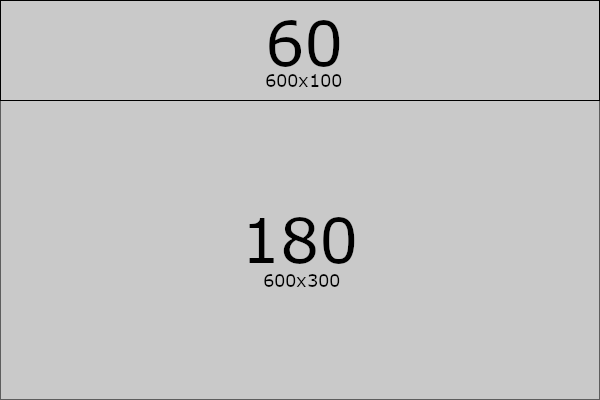
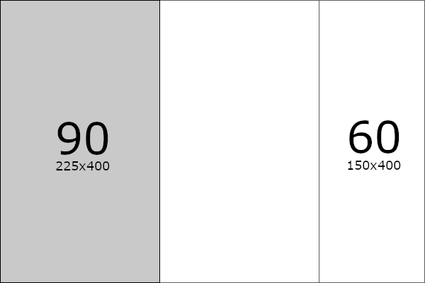

#GVI Projekt 1 - Diagramme

author: Felix Schick (71scfe1bif), Nicolas Mohr (81moni1bif)   
date: 27. Oktober 2019

## Aufgabe 2

### Teilaufgabe f)

Im Folgenden soll die Eignung der verschiedenen Diagrammtypen fuer die vorliegenden Daten bewertet werden.

Dafuer klassifizieren wir zuerst die Daten:
 - Die Urbildmenge ist diskret verteilt.
 - Die Dimension Dim(A) der Urbildmenge ist 2, wobei Variablen je aus einem Element der Menge der Monate `M1 = {Januar, ..., Dezember}` 
 und einem Element der Menge der Jahre `M2 = {2012,2013, 2014}` bestehen.
 Alternativ kann die Urbildmenge auch als eindimensional definiert werden, indem das Kartesische Produkt der Menge der Monate und der Menge der Jahre `M3 = cP(M1, M2) = {(Januar,2012), (Februar, 2012), ... (Dezember, 2014)}` als Variablenmenge verwendet wird.
 - Die Bildmenge ist quantitativ skaliert.

Nun laesst sich die Eignung der Diagrammtypen beurteilen.

---
M3             |  M1&M2
:-------------------------:|:-------------------------:
  |  

#### a. PieChart
Eine PieChart eignet sich gut fuer diskret verteilte Urbildmengen und quantitativ skalierte Bildmengen, solange nur wenig Elemente abgebildet werden. Folglich ist sie fuer die Abbildung von M3 mit 36 Elementen ungeeignet.
Da mehrdimensionale Urbildmengen mit einer einzelnen Piechart nicht moeglich sind, muesste man bei Urbildmenge anhand von (M1, M2) mehrere PieCharts verwenden, die nebeneinander oder ineinander platziert werden. Selbst mit dieser Loesung bleibt die Komplexitaet des Diagramms durch die vielen Elemente zu hoch.

---
M3            |  M1&M2
:-------------------------:|:-------------------------:
  |  
#### b. LineChart
Eine LineChart eignet sich gut fuer diskret verteilte Urbildmengen und quantitativ skalierte Bildmengen, auch wenn viele Elemente abgebildet werden.
So kann der Verlauf der Werte ueber die drei Jahre anhand von M3 trotz der 36 Elemente uebersichtlich abgebildet werden.

Bei der Verwendung einer zweidimensionalen Urbildmenge mit Variablen aus (M1, M2) koennen zusaetzlich die Werte derselben Monate ueber verschiedene Jahre gut miteinander verglichen werden. Damit erreicht die LineChart eine sehr hohe Aussagekraft.

---
M1&M2 |
:---: |
 |
#### c. AreaChart
Wie die LineChart eignet sich auch die AreaChart gut fuer diskret verteilte Urbildmengen und quantitativ skaliert Bildmengen, auch wenn viele Elemente abgebildet werden.

Verwendet man das kartesische Produkt M3 als Urbildmenge, ist der Aussagewert derselbe wie der einer LineChart anhand von M3.

Bei der Verwendung einer zweidimensionalen Urbildmenge mit Variablen aus (M1, M2) lassen sich zwar die konkreten Werte der Bildmenge schwerer ablesen als bei einem korrespondieren LineChart, dafuer visualisiert die totale Laenge entlang der y-Achse der Areachart fuer jeden Monat gut, welche Monate in der Summe ueber die Jahre die am (wenigsten) heizintensivsten Monate waren.

---
M1&M2 |
:---: |
 |
#### d. ScatterPlot
Der ScatterPlot bietet dann vorteile gegenueber der LineChart, wenn mehrere quantitativ skalierte Variablen miteinander verglichen werden sollen. Da in unserer Datenmenge nur eine quantitativ skalierte Variable (die der Zielmenge) vorliegt, bietet der Scatterplot hier keinen Mehrwert.

---
M1&M2 |
:---: |
 |
#### e. BubbleChart
Die Bubblechart eignet sich gut, um drei, typischerweise quantitative, Dimensionen an Daten auf einmal darzustellen.
Waehlen wir die Variablen unserer Urbildmenge anhand von (M1, M2) als erste und zweite Dimension für die Positionierung der Bubbles und die Werte der Zielmenge als dritte Dimension für die Größe der Bubbles, erhalten wir 36 verschieden große Bubbles in einer tabellarisch wirkenden Anordnung, was nur geringe visuelle Aussagekraft bietet.
Eine Darstellung anhand von M3 ist unmöglich, da keine drei Dimensionen mehr gebildet werden können.
Somit ist die BubbleChart ungeeignet zum Darstellen der vorliegenden Daten.

#### Fazit
Es empfiehlt sich die Verwendung einer LineChart anhand der mehrdimensionalen Urbildmenge (M1, M2) wenn der Vergleich der Werte derselben Monate über verschiedene Jahre im Vordergrund stehen soll.

Steht eine Veränderung der Werte im Verlauf der Zeit, ungeachtet der Werte einzelner Monate, im Vordergrund, ist die Verwendung einer LineChart anhand von M3 besser geeignet.

Steht das leichte Bestimmen von Maxima und Minima der Summe der Werte einzelner Monate ueber die verschiedenen Jahre im Vordergrund ("am meisten geheizt in Monat a", "am wenigsten geheizt in Monat a"), ohne viel der Aussagekraft der LineChart zu verlieren, ist auch eine AreaChart anhand von (M1, M2) gut geeignet.

## Aufgabe 3

### TreeMap in 600x400

Ordner 1:  
Datei1: 90 KB, Typ: DOC  
Datei2: 60 KB, Typ: PNG  
Datei3: 30 KB, Typ: PDF  

Ordner 2:  
Datei4: 40 KB, Typ: DAT  
Datei5: 20 KB, Typ: DAT 

Die Seitenverhältnisse in den einzelnen Schritten werden durch "X"x"Y" angegeben. Die Rechnungen werden jedoch nach dem **Squarified TreeMap** Algorithmus *Längere Kante* / *Kürzere Kante* berechnet.

 Schritt 1 | Schritt 2 |
:---------:|:----------:
| |
Verhältnis 450/400 = 1,25 | Verhältnis 600/100 = 6

 Schritt 3 | Schritt 4 |
:---------:|:----------:
| |
Verhältnis 400/150 = **2,66** | Verhältnis 400/225 = 1,78

 Schritt 5 | Schritt 6 |
:---------:|:----------:
| |
Verhältnis 375/160 = 2,34 | Verhältnis 267/225 = **1,19**

 Schritt 7 | Schritt 8 |
:---------:|:----------:
| |
Verhältnis 400/75 = 5,33 | Verhältnis 225/133 = **1,7**

 Schritt 9 | Schritt 10 |
:---------:|:----------: 
| |
Verhältnis 267/150 = 1,78 | Verhältnis 400/50 = 8

Schritt 11 |
:--------: |
| 
Verhältnis 150/133 = **1,13**

